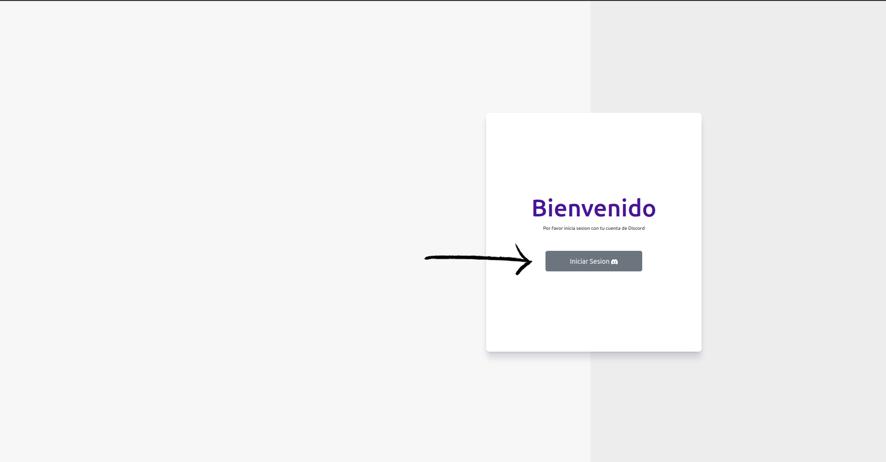
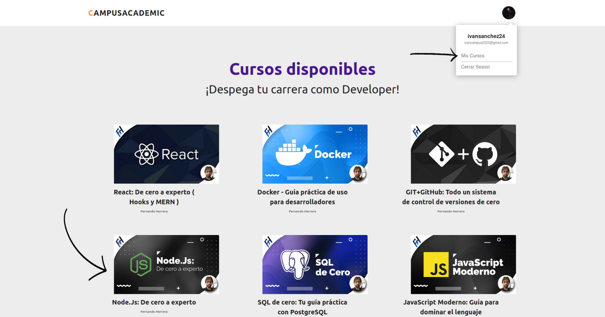
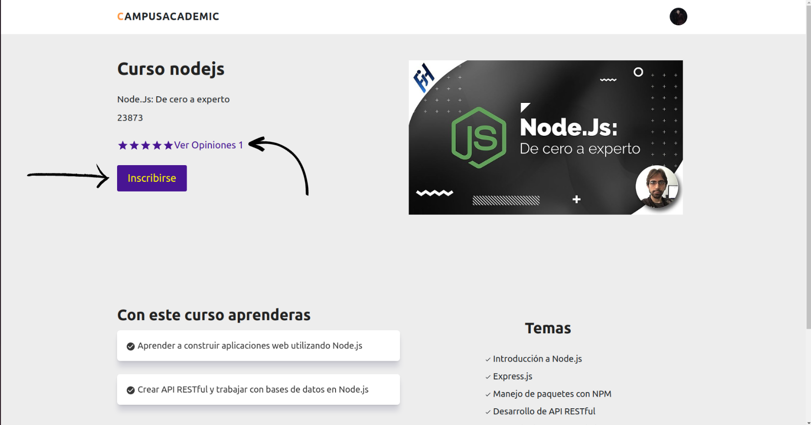
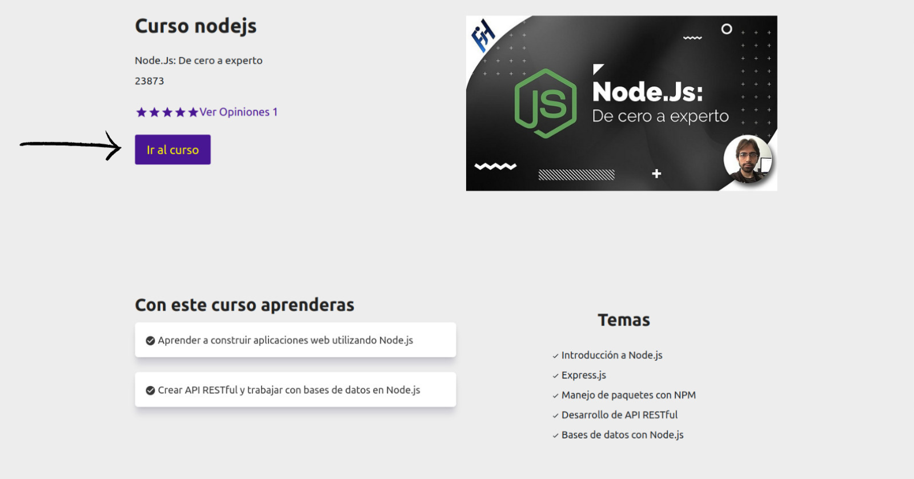
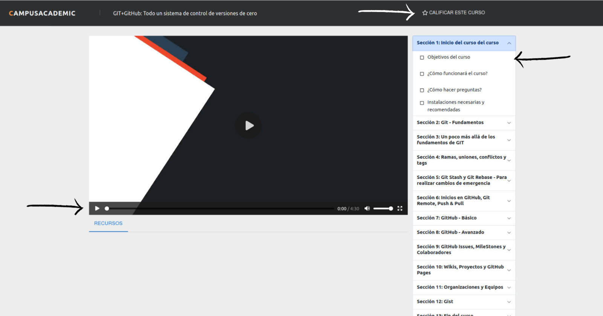
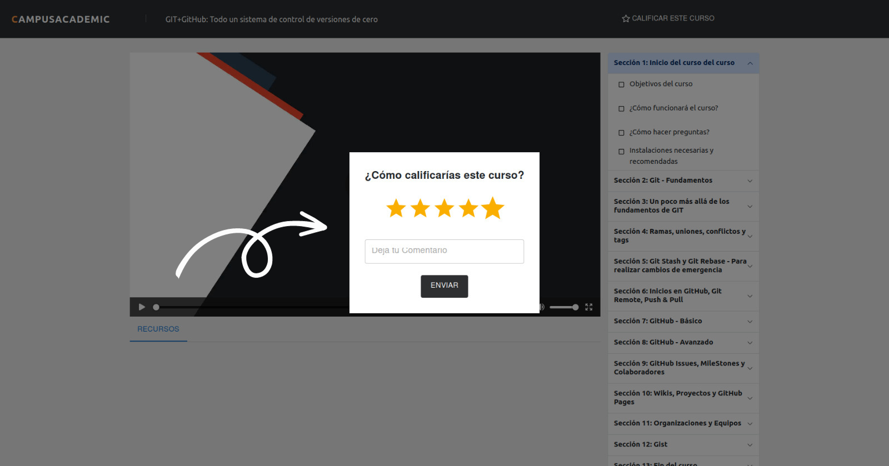
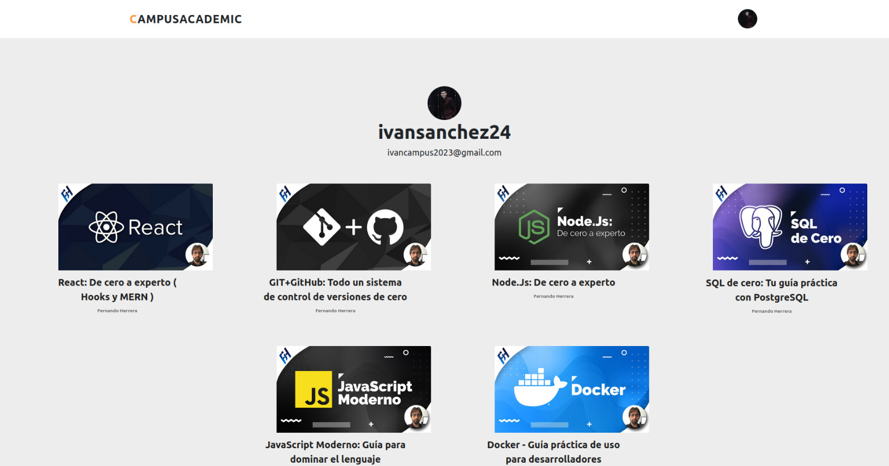

# Platform Academic Campus

### Instalacion local

    -Descargar o clonar el repositorio
    -Configurar las variables de entorno (tome como guia el .env-example)
    -instalar las dependencias con el comando =>  npm install
    -Correr proyecto backend => npm run prueba
    -Correr proyecto frontend => npm run dev (en otra terminal)

### Guia de uso

En primer lugar tenemos el login, con el cual iniciamos sesion mediante nuestra cuenta de  discord

En segundo Lugar tenemos la interfaz principal donde visualizamos todos los cursos disponibles 

Por otra parte tenemos la vista general de un curso en especifico- podemos observar que no sale la opcion de inscribirnos y otra informacion acerca de lo que trata el curso

-darle click inscribir, se nos habilitara la opcion de ver el curso y asi mmismo nos llegara un correo electronico dandonos la bienvenida al curso

En otra instancia tenemos el apartado de opiniones, aqui observamos cada una de las valoraciones que han dado los campers con respecto al curso

-Ahora iremos a ver la interfaz de ver un curso

como podemos ver tenemos una lista deplegable en la cual podemos encontrar todos las secciones y videos del correspondiente curso

en la parte superior derecha podemos observa el texto calificar curso, alli podemos dejar nuestra valoracion que se podra observar en el apartado de opiniones

Volviendo a la interfaz principal observamos en la parte superior nuestra foto de perfil de discord  al dar clik  nos saldra la opcion de dar ver mis cursos, aqui podras encontrar los cursos en los cuales te has inscrito 

